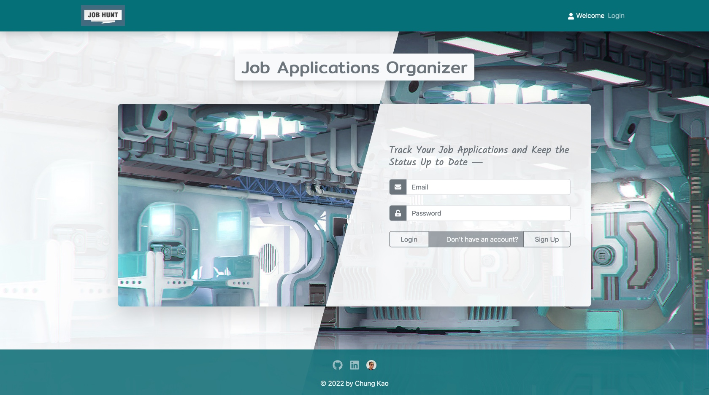

<h2 align="center">Job Hunt App ⏤ Server</h2>

<h4 align="center">A Personal Job Application Organizer-Tracker</h4>

for Code the Dream, Orange Alpaca 2022

    

## About

This repo is for the Jub Hunt app's server-side code on deployment. Please visit the project's [main repo](https://github.com/Sanlung/ctd-job-hunt) for the entire MERN stack app's code, which can be cloned and run locally on the same or separate ports.

### Cntributor

### License

MIT license
